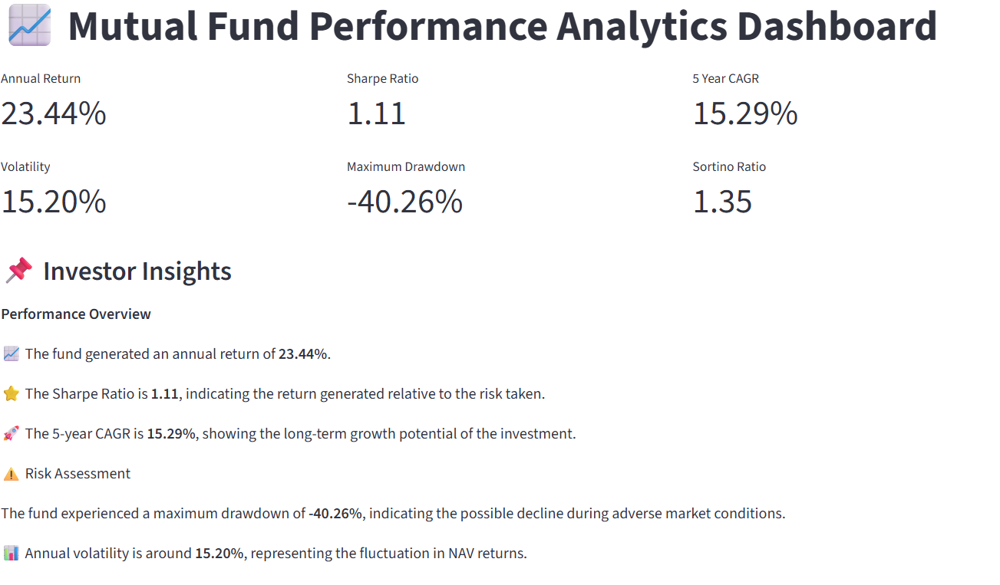

# Mutual Fund Performance Analytics Project

## Project Overview

This project performs end-to-end analysis of mutual fund NAV data.
The objective is to evaluate fund performance, risk, and investment behavior using Python and financial analytics techniques.

## Features

- Data ingestion and preprocessing
- NAV trend analysis
- Daily return calculation
- Annual return calculation
- CAGR calculation (1Y, 3Y, 5Y)
- Sharpe Ratio calculation
- Sortino Ratio calculation
- Maximum Drawdown analysis
- Risk metrics evaluation
- Interactive Streamlit dashboard

## Technologies Used

- Python
- Pandas
- NumPy
- Matplotlib
- Streamlit
- Jupyter Notebook
- Git & GitHub

## Project Structure
MutualFund_EDA_Project

├── data
│ ├── raw
│ └── processed
│
├── notebooks
│
├── scripts
│
├── dashboard
│ └── app.py
│
└── README.md

## Dashboard

The Streamlit dashboard provides:

- Fund performance overview
- NAV movement visualization
- Risk analysis
- Daily return distribution
- Performance summary

## How to Run

Install dependencies:
pip install -r requirements.txt

Run dashboard:
streamlit run dashboard/app.py

## Key Metrics

The project evaluates:

- Return performance
- Risk-adjusted returns
- Volatility
- Drawdown
- Long-term growth

## Dashboard Preview

## Author

Sambhavi